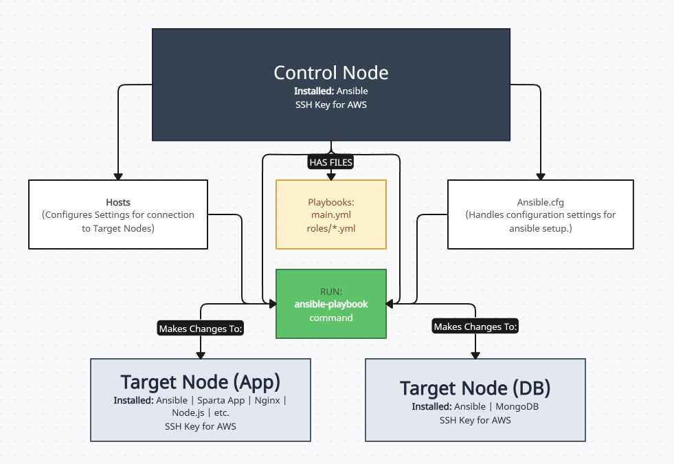
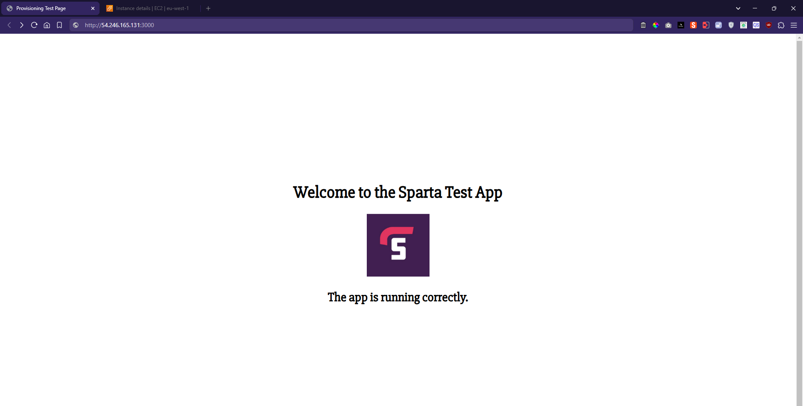
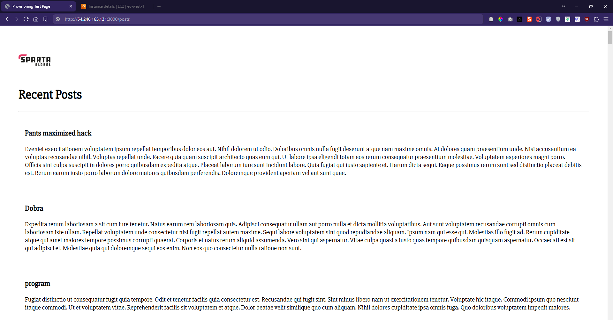

# Setting Up Ansible for Sparta App Deployment

- [Setting Up Ansible for Sparta App Deployment](#setting-up-ansible-for-sparta-app-deployment)
  - [General Goals](#general-goals)
  - [My Implementation Process](#my-implementation-process)
    - [1. Setting Up WSL](#1-setting-up-wsl)
    - [2. Installing Ansible](#2-installing-ansible)
    - [3. Project Structure Setup](#3-project-structure-setup)
    - [4. Inventory Configuration](#4-inventory-configuration)
    - [5. EC2 Instance Management](#5-ec2-instance-management)
    - [6. System Updates](#6-system-updates)
    - [7. Nginx Installation](#7-nginx-installation)
    - [8. Playbook Organization](#8-playbook-organization)
  - [Outcome](#outcome)
  - [Blockers](#blockers)




## General Goals
- Install Ansible on WSL (Windows Subsystem for Linux)
- Use Ansible to provision and configure an EC2 instance with:
   - Git
   - Nginx
   - NodeJS
   - MongoDB
   - PM2
   - Other dependencies for the [Sparta App](https://github.com/AmeenahRiffin/tech501-sparta-app)
- Configure ports 3000 and 27017 for the app and MongoDB respectively

## My Implementation Process

### 1. Setting Up WSL
Since I couldn't install Ansible directly on Windows, I opted for WSL. I installed Ubuntu using:

```bash
wsl --install -d Ubuntu
```

I created my account with username 'AmeenahRiffin'. To access the Ubuntu terminal later, I simply use:

```bash
wsl -d Ubuntu
```

### 2. Installing Ansible
Within my Ubuntu environment, I installed Ansible using:

```bash
sudo apt update && sudo apt upgrade -y
sudo apt install ansible -y
```


### 3. Project Structure Setup
I created a dedicated project directory with necessary files:

```bash
mkdir ansible-sparta-app
cd ansible-sparta-app
touch playbook.yml inventory.ini
```

### 4. Inventory Configuration
I set up my inventory.ini with the following structure:

```ini
[app]
<target-node-ip>

[all:vars]
ansible_user=ubuntu
ansible_ssh_private_key_file=~/.ssh/aws-ansible-key
```

### 5. EC2 Instance Management

I created my EC2 instances in AWS:


Initially, I encountered connectivity issues:


I resolved this by transferring my AWS key to the target node:

```bash
ansible web -m copy -a "src=/.ssh/ameenah-aws-key.pem dest=/home/ubuntu/.ssh/ameenah-aws-key.pem owner=ubuntu group=ubuntu mode=0400" --become
```


Success! I could now ping my target node:


### 6. System Updates
I explored different methods for running updates:

Using command module:
```bash
ansible web -m command -a "apt update" --become
```


Using shell module:
```bash
ansible web -m shell -a "apt update && apt upgrade" --become
```


Using apt module:
```bash
ansible web -m apt -a "update_cache=yes upgrade=dist" --become
```


### 7. Nginx Installation
I successfully installed and verified Nginx:


```bash
ansible-playbook install_nginx.yml
```

Verification:


### 8. Playbook Organization
I created a main.yml to orchestrate all my playbooks:


To run all playbooks:
```bash
ansible-playbook main.yml
```

All the playbooks run successfully, and I verified the results.

**Facts Playbook:**
* [Gather System Facts](ansible/play_facts_project/roles/print-facts.yml)

**System Updates:**
* [Update and Upgrade System](ansible/update_and_upgrade/roles/update_upgrade_all.yml)

**Application Playbooks:**
* [Configure Nginx Web Server](ansible/app_project/roles/configure_nginx.yml)
* [Deploy Node Application](ansible/app_project/roles/deploy_app.yml)
* [Install Application Dependencies](ansible/app_project/roles/setup_dependencies.yml)
* [Setup Node.js Environment](ansible/app_project/roles/setup_node.yml)

**Database Playbooks:**
* [Configure MongoDB Settings](ansible/db_project/roles/configure_db.yml)
* [Install and Setup MongoDB](ansible/db_project/roles/setup_mongodb.yml)

**Web Server Configuration:**
* [Configure Nginx Web Server](ansible/app_project/roles/configure_nginx.yml)

## Outcome
Ansible successfully provisioned and configured an EC2 instance with all required dependencies for the Sparta App deployment. The automation process included:

1. Installation of system packages and dependencies
2. Node.js environment setup and configuration
3. MongoDB database installation and configuration
4. Nginx web server setup and reverse proxy configuration

Initially encountered challenges with the MongoDB database setup, specifically caused by incorrect MongoDB configuration settings (When AWS shuts down, I had to reconfigure the ips of the app and database in the ansible settings as the IP changed)

This was resolved by simply changing the IP addresses in the ansible settings file.

Main Sparta Page Working on Target App Node:


Database Connectivity Established (Posts Page seeded):

- Successfully created and seeded the posts collection
- Verified data persistence across application restarts
- Confirmed proper read/write operations

## Blockers
While there were no major blockers that prevented completion, the following challenges required additional troubleshooting time:

Database Connectivity Issues:
   - Spent approximately 2 hours debugging MongoDB connection problems
   - Needed to modify ansible configuration settings to resolve connectivity issues

