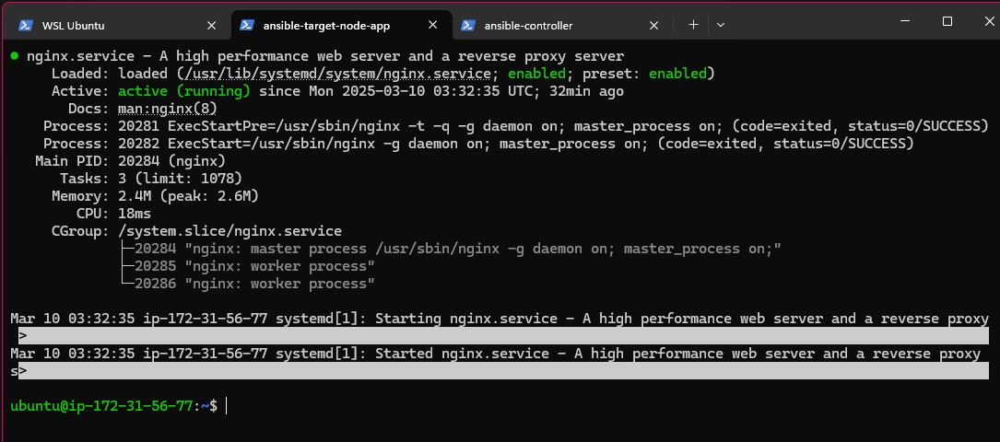

General Goals
- Install Ansible (On WSL)
- Use Ansible to create an EC2 instance and install Git, Nginx, NodeJS, MongoDB, PM2, and other dependencies needed for the Sparta App (https://github.com/AmeenahRiffin/tech501-sparta-app), get the database running on it. Configuring the Port 3000 and the mongoDB port 27017. 


Task:
3. Setup Ansible controller and first target node ('app' instance)

a. Task: Create EC2 instances for Ansible controller and first target node

b. Task: Setup dependencies for the Ansible controller and first target node

c. Task: Use other ad hoc commands

d. Task: Do update and upgrade on target nodes using ad hoc commands

e. Task: Consolidate ad hoc commands by copying a file to a target node

f. Task: Create and run playbook to install nginx on target node

g. Task: Create and run playbook to provision app VM

h. (Extension - if time) Task: Create and run playbook to print facts gathered


1. I was not able to install ansible on my windows machine, so I used WSL (Windows Subsystem for Linux) to install it. This was done by using the following command:

```bash
wsl --install -d Ubuntu
```

This allowed me to specify a distribution to install, which I chose to be Ubuntu. I set my username to AmeenahRiffin and the password to something I could remember.

To login to my ubuntu terminal if I log out, I navigate to the Ubuntu folder, and I used the following command:
```bash
wsl -d Ubuntu
```

2. Once I had installed WSL, I was in my ubuntu terminal. I then used the following commands to install ansible:
   ```bash
   sudo apt update && sudo apt upgrade -y
   sudo apt install ansible -y
   ```

  This installed ansible on my ubuntu machine.
  

3. I then created a new directory called ansible-sparta-app. In this directory I created a new file called playbook.yml and inventory.ini. This is where I wrote my playbook and inventory.

The commands I used were:
```bash
mkdir ansible-sparta-app
cd ansible-sparta-app
touch playbook.yml inventory.ini
```

4. Create inventory.ini file with target hosts:
```ini
[app]
<target-node-ip>

[all:vars]
ansible_user=ubuntu
ansible_ssh_private_key_file=~/.ssh/aws-ansible-key
```

5. For creating EC2 instances:
```bash
# Launch EC2 instances from AWS Console or CLI
# Ensure to use Ubuntu 18.04 AMI
# Configure security groups to allow SSH access
```


(This needed me to put the correct directory for the key, and also format the message so it's all on one line)


command:


shell:


apt:


Copying SSH Key to the target node:


Installing nginx:


```ansible-playbook install_nginx.yml
```

Checking if nginx is running on the target node:



